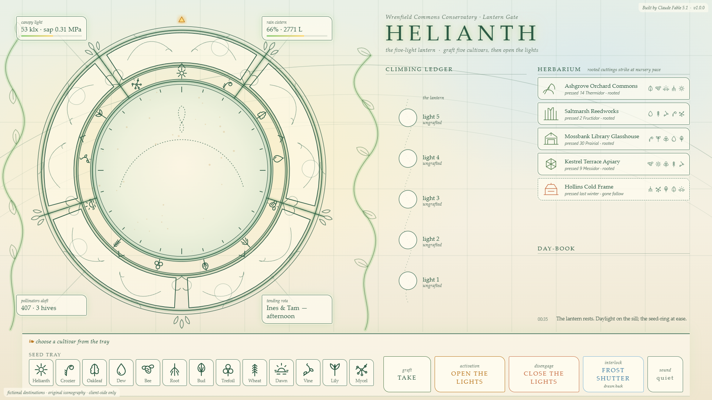

# HELIANTH — Wrenfield Commons Conservatory · Lantern Gate

> **Status:** confirmed — the operator has directly tested this build by hand and confirmed it is functional and solid. That confirmation is the operator's own hands-on testing, not this session's automated checks; the "What was verified" section below documents what the harness exercised, which supported but does not stand in for that direct testing.
>
> The operator's accepted read of the finished piece: the visual execution leans toward the organic/nature side of the solarpunk brief more than a fully balanced technology-and-ecology blend.

A solarpunk portal-dialing console. The instrument is the *lantern* — the glazed cupola at the crown of a commons conservatory — drawn as luminous Art Nouveau greenhouse linework on a daylight ground. An address is five cultivars grafted into the lantern's five lights; opening the lights lets the sun through the oculus and the way stands open until the lights are closed. Everything is fictional and original: no franchise names, iconography or addresses.



## The idea

Solarpunk, taken seriously rather than as a palette: high technology grown into ecology, communal stewardship rather than industrial control, and the organic, whiplash-curved visual language of Art Nouveau glasshouse architecture. So the console is not a dark HUD. It is a sunlit potting bench under a conservatory dome, and every "material" on screen is glowing ink — no glass, wood or leaf textures, only schematic botanical line-work with a soft luminous halo.

- **The Lantern** — a five-light cupola: outer drum, five hinged sashes with whiplash ornament, a sill, and the oculus. Between the drum and the oculus turns the **heliotropic seed-ring**, carrying the thirteen cultivars.
- **Cultivars (13)** — Helianth, Crozier, Oakleaf, Dew, Bee, Root, Bud, Trefoil, Wheat, Dawn, Vine, Lily, Mycel. Thirteen and five are both phyllotaxis numbers; five is the count of a pentamerous flower.
- **Address length: 5** — one cultivar per light.
- **Locking gesture: the graft *takes*.** Choose a cultivar from the seed tray; the seed-ring slews it under the next open light; press **TAKE**; a tendril grows from the sill notch up into the light, two leaves unfurl, a five-petal bloom opens, and the cultivar is sealed into the light. The **climbing ledger** on the right grows one node per graft.
- **Activation: OPEN THE LIGHTS.** The five sashes swing edge-on while sap climbs the ribs and ripples tighten in the oculus (buildup, 2.6 s) → a petal burst and flash (breakthrough) → the **sunwell**: a slow caustic weave of gold and green with seeds drifting through (sustained active). Nothing ever auto-fires: the fifth graft leaves the lantern *ready*; only OPEN opens it.
- **Disengage: CLOSE THE LIGHTS.** Always reachable — mid-strike, mid-buildup, mid-active. The blooms fold, the tendrils retract, the ledger is cut back.
- **Interlock: the Frost Shutter.** Released by default. Drawn, it blocks TAKE and OPEN with a cold veil, frost crackle over the lantern, a cooled sky and a shiver tone; drawing it mid-strike halts the pressing; drawing it while the lights are open closes them.
- **Quick-dial: the Herbarium.** Five *pressings* — pressed, rooted routes. In-universe, a rooted cutting strikes faster than seed, so a pressing grafts its five cuttings at nursery pace: each one still slews and grafts visibly (about 4.8 s for all five), never instantly. *Hollins Cold Frame* has gone fallow: it builds up, then no light answers and the lights fall closed.
- **Sound** — entirely synthesised with Web Audio (no audio files): wooden tick on choosing a seed, a rustle while the ring turns, snip + a breathy flute rising into a water-drop *plink* as the graft takes, a bee-hum and wind drone for the buildup, a flute-harmonic chord at breakthrough, a warm drone with bird trills and drips while the way is open, a cold shiver for frost. Sound starts on the first click and can be muted with the *sound* button.
- **Telemetry** is communal, not industrial: hung tags for canopy light and sap pressure, the rain cistern, pollinators aloft and hive count, and the tending rota. The open way visibly lifts light and pollinators.

### Composition

Deliberately not the usual top-bar / hero / two wings / bottom deck. The lantern sits off-centre left like a sun in a sky, with four notice tags hung from its rim into the corners of its square. The right side is a single tall column: nameplate, the climbing ledger (which *is* the address display), the herbarium, and the day-book. The bottom is one potting bench holding the only two control clusters of the core loop — the seed tray and the grafting tools. A faint conservatory glazing grid and two trained vines sit behind everything.

## Run it locally

```bash
npm run serve
```

Then open <http://127.0.0.1:8685/>. The server is a zero-dependency Node static server (`server.js`, port 8685, `PORT`/`HOST` env overrides). The page itself is plain HTML/CSS/JS with no build step, no modules, no network calls and no shared files with any other folder.

## Self-test

```bash
npm install
npm test
```

`test/run-tests.mjs` drives the served page in headless **system Chrome** through puppeteer-core with real mouse events. Every click is hit-tested first with `elementFromPoint` at the control's rendered centre, so an occluded control fails rather than being driven through the DOM. It writes evidence screenshots to `screenshots/` and a `screenshots/test-report.json`. `npm run capture` writes `preview.png` (cold-start idle, 1920×1080).

## What was verified (by the build's own harness, this session)

Final run: **42 / 42 checks passed**, no console or page errors. Concretely observed:

- Boot: idle phase, 13 seeds in the tray and 13 glyphs on the seed-ring, 5 lights, 5 pressings; Frost Shutter released; `[hidden]` reset really hides the veil and flash; stage transform is `matrix(1,…)` at 1920×1080 and `matrix(2,…)` at a simulated 3840×2160.
- Geometry: all 23 controls hit-test to themselves at both viewports.
- Manual dial: choosing Oakleaf turned the ring (−7.7° mid-slew → −55.4° settled, 0.000° error against the computed target); notch and TAKE read as armed; mid-growth the tendril's dash-offset was strictly between full and zero (22 of 91); after the take, light 1 carried the Oakleaf seal, the bloom sat at scale 1, the ledger node and tray seed were marked.
- Fast operator: re-choosing mid-slew retargeted; TAKE pressed mid-slew queued and took on its own; choosing a seed mid-graft queued it for after the take. A grafted seed cannot be chosen again.
- Five grafts → pending, OPEN reads ready, ledger stem fully grown; **negative:** still pending with zero opens 1.6 s later; the tray ignores clicks while pending.
- Frost: drawing the shutter set body/veil/crackle/button state; OPEN under frost was refused with cold feedback (blocked = 1, still pending); TAKE under frost refused; drawing it mid-pressing halted the strike at one graft with a single day-book alert; releasing restored the ready lantern.
- Activation: buildup ran with the drone audio node alive and sashes at `scaleX ≈ 0.28`; breakthrough fired with the flash visible; active had the active drone, `body.active`, OPEN disabled and CLOSE enabled. Oculus pixel proof from the screenshots (mean luminance / mean R−B warmth over a 150 px disc): pending 239/24, buildup 229/72, breakthrough 240/60, active 221/105 — all four pairwise ≥ 12 apart, warmth rising pending → buildup → active.
- Telemetry coupling while open: canopy light 82 klx, pollinators aloft 662 (idle ≈ 55 / ≈ 410).
- Disengage from active → closing → idle with 0 taken lights, 0 blooms, 0 tendrils, 0 ledger nodes, active audio stopped. A second full dial → open → active → close cycle completed (breakthroughs 2, closes 2). CLOSE mid-buildup aborted before breakthrough; CLOSE mid-pressing cancelled the strike.
- Pressing (Saltmarsh Reedworks): graft count seen at 0, 1, 2, 3, 4, 5 with first-seen times 16 / 905 / 1845 / 2705 / 3590 / 4758 ms, slewing and grafting both observed between them, a mid-sequence screenshot taken at two-taken-third-growing; landed pending, never auto-opened.
- Fallow (Hollins Cold Frame): built up, then closed with no breakthrough and the "shuttered for the season" day-book line.
- Sound toggle mutes and unmutes; 130 synth calls were made over the run.

Evidence frames: `screenshots/01-idle.png` … `11-4k-idle.png` (slew mid-turn, tendril mid-growth, pending, buildup, breakthrough, active, mid-pressing, frost-blocked, fallow, 4K idle). I also looked at the idle, buildup, breakthrough, active, mid-pressing, frost and fallow frames myself and judged the three activation stages visibly different from each other.

Separately, the idle page was loaded in the Claude app's embedded browser (Chromium 148, 1280×720, fit 0.667) and screenshotted. That surfaced one real rendering defect — SVG `<text>` labels in the climbing ledger drew oversized and displaced under the CSS-scaled stage, while system Chrome 152 drew them correctly — which was fixed by moving those labels to HTML, then re-verified in both browsers. No interaction was performed in the embedded browser.

## What is NOT verified — needs a human

- **Anything heard.** The harness confirms the Web Audio graph is built and the synth functions are called; nobody has listened to it. Levels, timbre and whether the buildup swell lands are unjudged.
- **Motion as perceived.** Screenshots are single frames. Smoothness of the seed-ring slew, tendril growth, sash swing and the sunwell weave has not been watched in real time.
- **Real pointer feel** — hover states, click responsiveness, double-click accidents, and the fast-click paths under a human hand rather than dispatched events at computed centres.
- **Other browsers and real monitors.** Only headless Chrome at 1920×1080 and 3840×2160 was exercised. Firefox/Safari, non-16:9 windows, DPR scaling on a real display, touch, and reduced-motion preference are untested.
- **Long-running behaviour** (hours open, tab hidden/restored, audio context suspension on a real device).
- **Gallery integration.** The hub catalog was not regenerated or touched; this folder has the README/preview/version files the hub expects, but its card has not been generated or looked at.

## Files

`index.html`, `style.css`, `app.js` (all of the page), `server.js` (static server), `package.json`, `version.json`, `CHANGELOG.md`, `preview.png`, `screenshots/`, `test/run-tests.mjs`, `test/capture.mjs`, `.gitignore`.

Original work; no shared assets, styles or scripts with any other folder.
